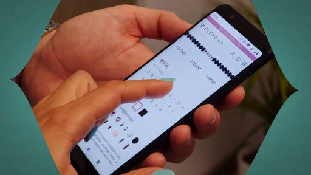
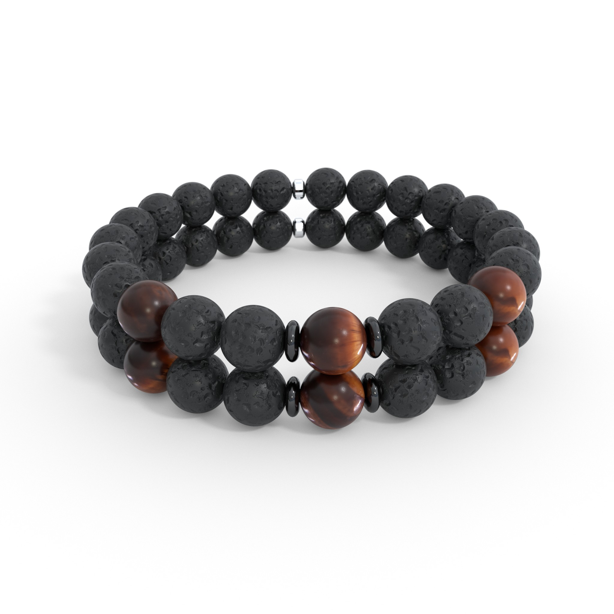
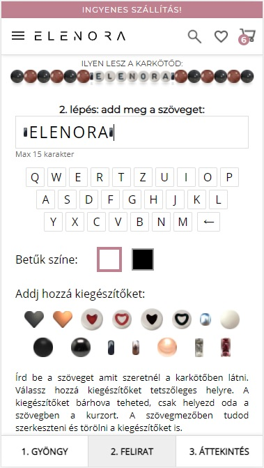
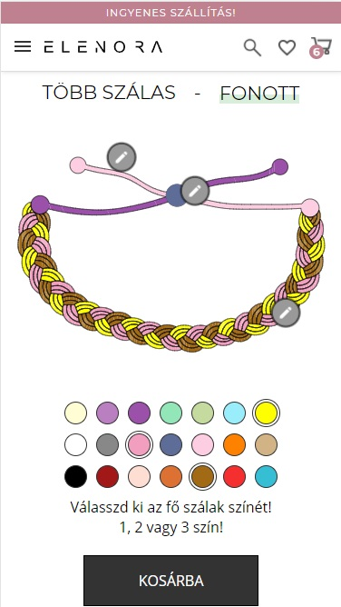
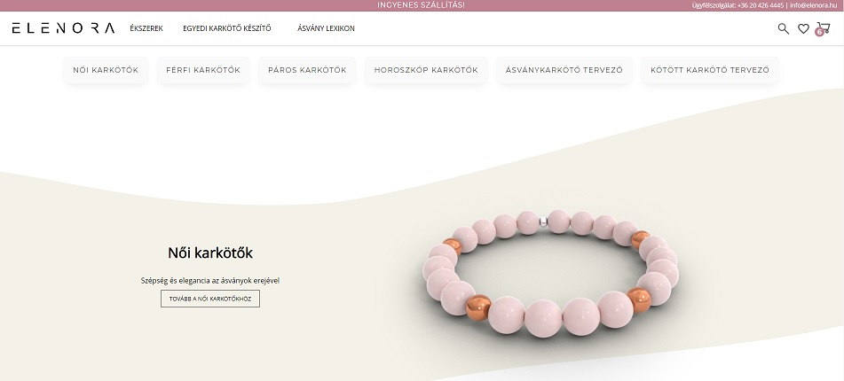
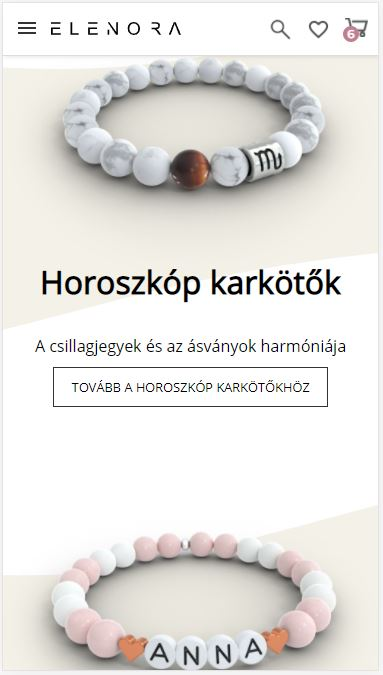

A custom built e-commerce store with over 10,000 sales. The website features two bracelet designer tools allowing customers to customize beaded and string bracelets. It also has tooling for creating and uploading products automatically from a Google Spreadsheet with 3D rendered images and 360° videos.

# Backstory
My wife makes bracelets as a hobby and I built this website for her as a hobby project. This little hobby rapidly grew into a somewhat big family business where we needed the collaboration of multiple family members to be able to fulfill all the orders. The e-commerce store was also featured on the most popular hungarian TV station (RTL Klub).

The business was active for 3 years. After my wife got pregnant with our second baby we decided that running the store was too much work and decided to shut it down. The original was in hungarian but I translated it to english to be able to better showcase it in my portfolio. 

# Custom E-commerce Store
Custom ASP.NET MVC Core e-commerce website built from scratch. The backend is build using ASP.NET MVC Core with a Postgres database. The website is hosted on Amazon AWS, it is containerized using Docker. There is also an admin panel built with Angular. The images are 3D rendered using Blender python scripts.

## Integrations with 3rd party apps
 - Barion payment processor (this is a payment processor similar to PayPal, popular in Europe)
 - Facebook Conversions API for sending purchase and other events to facebook for ad optimizations
 - SendGrid for sending automated emails for order status and marketing messages
 - GLS Shipping integration
 - Google analytics and GA4 integrations

## Features
### Automated rendering of photo-realistic product images
The code for the automated jewelry renderer can be found in this repo: https://github.com/boros-csaba/3d-bracelet-render-image-generator
The bracelets are made from gemstone beads and charms. My wife comes up with the design for the bracelets and writes down the beads in a Google Sheet. An automated task picks up the changes and generates a rendered image of the bracelet and automatically uploads it to the store. Here is an example image of a bracelet:  

### Automated marketing email funnels
Users are assigned randomly to email marketing funnels and emails are sent out to them regularly based on the content of the assigned funnel. Having multiple funnels allows for optimizing and comparing the marketing emails efficiency. The emails are sent using SendGrid. 
### Custom beads bracelet designer tool with live preview
Customers can create their own bracelets in a designer tool in the shop. This is also custom built by me and it has a huge success in terms of sales. Customers can choose the types of beads, write any text with black or white letters and add additional charms to the bracelet.  

### Strings bracelet designer tool with live preview
The color of each string is customizable and the end result is immediately visible.  

### Responsive UI
The website is designed and implemented using SCSS and jQuery. The cart events are handled using AJAX so the entire page is not reloaded when an item is added or removed from the cart.

